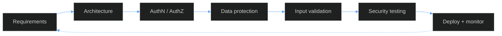

<!-- Dark Blue — Professional Engineering | Palette: #020617 #0B1220 #1E3A8A #2563EB #3B82F6 #60A5FA -->

  

  

  
  
  
  
  
  
  

<!-- ============ KPI STRIP ============ -->

<table width="100%">
  <tr align="center">
    <td width="25%"></td>
    <td width="25%"></td>
    <td width="25%"></td>
    <td width="25%"></td>
  </tr>
</table>

<!-- ============ OVERVIEW ============ -->

<table width="100%">
  <tr>
    <td width="60%" valign="top">
      <b>About</b>  
      I'm a Computer Science and Engineering student specializing in Cybersecurity. I build backend systems and web applications in Python and Flask, and I try to get security, testing and maintainability right from the start instead of adding them at the end.  
      I'm currently looking for software engineering and cybersecurity internships.
    </td>
    <td width="40%" valign="top">
      <b>Snapshot</b>  
      <b>Field</b> &nbsp;&nbsp;&nbsp;&nbsp;&nbsp; Computer Science &amp; Engineering 
      <b>Specialization</b> &nbsp; Cybersecurity 
      <b>Focus</b> &nbsp;&nbsp;&nbsp;&nbsp;&nbsp; Backend, secure application development 
      <b>Looking for</b> &nbsp; Software engineering and cybersecurity internships 
      <b>Credentials</b> &nbsp; Cisco Certified Ethical Hacker, hackathon and CTF participant
    </td>
  </tr>
</table>

<!-- ============ STACK ============ -->

<table width="100%">
  <tr>
    <td width="16%"><b>Languages</b></td>
    <td></td>
  </tr>
  <tr>
    <td><b>Backend</b></td>
    <td>
      
      &nbsp;
      
    </td>
  </tr>
  <tr>
    <td><b>Databases</b></td>
    <td></td>
  </tr>
  <tr>
    <td><b>Tools &amp; DevOps</b></td>
    <td></td>
  </tr>
  <tr>
    <td valign="top"><b>Security</b></td>
    <td>
      
      
      
      
      
      
      
      
      
    </td>
  </tr>
</table>

<!-- ============ PROJECTS ============ -->

<table width="100%">
  <tr>
    <td width="33%" valign="top">
      <h3>🔐 Secure Evidence Management Platform</h3>
      <b>SECURE · COLLABORATIVE · AUDITABLE</b>  
      A security-focused platform for managing digital evidence with controlled access, encrypted storage, collaboration and auditability.  
      <ul>
        <li>Authentication, authorization, RBAC and MFA</li>
        <li>Encrypted evidence storage on cloud/object storage</li>
        <li>Real-time multi-user collaboration over WebSockets</li>
        <li>Audit logging</li>
        <li>Automated security testing, unit and integration tests</li>
        <li>Production-oriented deployment</li>
      </ul>
      
      
      
      
      
      
      
      
    </td>
    <td width="33%" valign="top">
      <h3>🏪 Inventory &amp; POS Management System</h3>
      <b>MANAGE · TRACK · SECURE</b>  
      A web-based inventory and point-of-sale system with authentication, database integration, product management and sales operations.  
      <ul>
        <li>User authentication and role-based access</li>
        <li>Product management and inventory tracking</li>
        <li>Sales management</li>
        <li>CRUD operations with database integration</li>
        <li>Secure backend</li>
      </ul>
      
      
      
      
      
    </td>
    <td width="33%" valign="top">
      <h3>🤖 AI-Driven Business Continuity Platform</h3>
      <b>AI · SECURITY · RESILIENCE</b>  
      A business continuity platform with security controls that protect users, data and system operations.  
      <ul>
        <li>Role-based access control and access control</li>
        <li>Multi-factor and secure authentication</li>
        <li>Encryption</li>
        <li>Audit logging</li>
      </ul>
      
      
      
      
      
    </td>
  </tr>
</table>

<!-- ============ SECURITY ============ -->

I treat security as part of development, not a final step. This is where each control shows up in my projects:

| Practice | Evidence Platform | Inventory & POS | Business Continuity |
|:--|:--:|:--:|:--:|
| Authentication | ✅ | ✅ | ✅ |
| Multi-factor authentication | ✅ | – | ✅ |
| Role-based access control | ✅ | ✅ | ✅ |
| Encryption | ✅ | – | ✅ |
| Audit logging | ✅ | – | ✅ |
| Automated security testing | ✅ | – | – |

<!-- ============ LEARNING + PRINCIPLES ============ -->

<table width="100%">
  <tr>
    <td width="55%" valign="top">
      <b>Currently learning</b>

| Topic | Progress |
|:--|:--|
| Backend Engineering | `███████████████████░░` |
| Application Security | `██████████████████░░░` |
| Secure API Development | `█████████████████░░░░` |
| Docker & Deployment | `████████████████░░░░░` |
| Cloud / Object Storage | `███████████████░░░░░░` |
| WebSockets & Real-time | `███████████████░░░░░░` |
| Automated Security Testing | `██████████████░░░░░░░` |
| System Architecture | `█████████████░░░░░░░░` |

    </td>
    <td width="45%" valign="top">
      <b>How I work</b>

1. Understand the problem
2. Design before implementation
3. Build modular systems
4. Validate inputs
5. Protect sensitive data
6. Test functionality
7. Test security
8. Automate repetitive work
9. Document the system
10. Deploy and monitor

    </td>
  </tr>
</table>

> **Good software works. Great software works securely.**

<!-- ============ ACTIVITY ============ -->

<table width="100%">
  <tr align="center">
    <td width="50%">
      
    </td>
    <td width="50%">
      
    </td>
  </tr>
  <tr align="center">
    <td colspan="2">
      
    </td>
  </tr>
  <tr align="center">
    <td colspan="2">
      
    </td>
  </tr>
</table>

<!-- ============ CONTACT ============ -->

<table width="100%">
  <tr>
    <td width="40%" valign="top">
      <b>Target roles</b>
      <ul>
        <li>Software Engineering Internship</li>
        <li>Cybersecurity Internship</li>
      </ul>
    </td>
    <td width="30%" valign="top">
      <b>Interests</b>
      <ul>
        <li>Backend engineering</li>
        <li>Secure software development</li>
        <li>Application and API security</li>
        <li>Cloud security</li>
        <li>Security automation</li>
        <li>System architecture</li>
      </ul>
    </td>
    <td width="30%" valign="top" align="center">
      <b>Get in touch</b>  
        
        
      
    </td>
  </tr>
</table>

  
  &nbsp;
  

