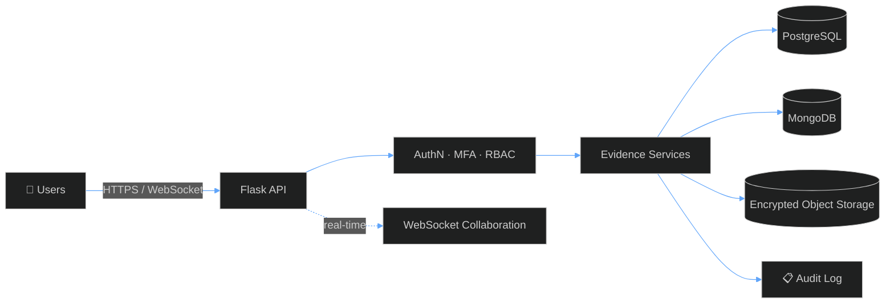
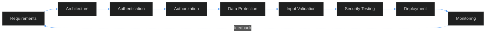

<!-- ============================================================
     YOGESH S V  ::  DARK BLUE — PROFESSIONAL ENGINEERING  (v2)
     Palette: #020617  #0B1220  #1E3A8A  #2563EB  #3B82F6  #60A5FA  #38BDF8
     ============================================================ -->

<a id="top"></a>

<!-- ===================== HEADER ===================== -->

<p align="center">
  
</p>

<p align="center">
  
</p>

<p align="center">
  <a href="https://github.com/yogi2306yo">
    
  </a>
  <a href="https://www.linkedin.com/in/yogesh-s-v-4317193a">
    
  </a>
  <a href="mailto:yogu23112006@gmail.com">
    
  </a>
</p>

<p align="center">
  
  
  
  
  
</p>

<!-- ===================== NAV ===================== -->

<p align="center">
  <a href="#about"></a>
  <a href="#stack"></a>
  <a href="#projects"></a>
  <a href="#security"></a>
  <a href="#learning"></a>
  <a href="#stats"></a>
  <a href="#connect"></a>
</p>


<!-- ===================== BOOT ===================== -->

# `> boot_sequence`

```bash
yogesh@secure-dev:~$ sudo ./init_profile.sh

[sudo] authenticating ........................... OK (MFA verified)
[ OK ]  Loading identity ........................ YOGESH S V
[ OK ]  Mounting domain ......................... Software Engineering × Cybersecurity
[ OK ]  Starting service ........................ backend-engineering
[ OK ]  Starting service ........................ application-security
[ OK ]  Enabling modules ........................ RBAC · MFA · Encryption · Audit Logging
[ OK ]  Loading toolchain ....................... Python · Flask · Docker · PostgreSQL
[ OK ]  Security posture ........................ SHIFT-LEFT ENABLED
[ >> ]  Status .................................. OPEN TO INTERNSHIPS

yogesh@secure-dev:~$ _
```


<!-- ===================== ABOUT ===================== -->

<a id="about"></a>

# `> whoami`

```text
╔══════════════════════════════════════════════════════════════╗
║  ▓▓▓  IDENTITY CARD  ▓▓▓                                     ║
╠══════════════════════════════════════════════════════════════╣
║                                                              ║
║   NAME      :  YOGESH S V                                    ║
║   FIELD     :  Computer Science & Engineering                ║
║   SPECIAL   :  Cybersecurity                                 ║
║                                                              ║
║   ROLES     :  Software Engineering                          ║
║                Backend Development                           ║
║                Secure Application Development                ║
║                                                              ║
║   CLEARANCE :  Cisco Certified Ethical Hacker                ║
║   STATUS    :  ● ONLINE  —  seeking internships              ║
║                                                              ║
╚══════════════════════════════════════════════════════════════╝
```

I'm a **Computer Science and Engineering student specializing in Cybersecurity**, interested in building software that is secure, scalable, and practical.

```python
class Yogesh(Engineer, SecurityEnthusiast):
    """Turning ideas into working systems — securely."""

    name        = "Yogesh S V"
    field       = "Computer Science & Engineering (Cybersecurity)"
    languages   = ["Python", "C"]
    backend     = ["Flask", "REST APIs", "WebSockets"]
    databases   = ["PostgreSQL", "MongoDB", "SQLite"]
    devops      = ["Docker", "Linux", "Git", "GitHub"]
    security    = ["AppSec", "AuthN/AuthZ", "RBAC", "MFA", "Cryptography", "Audit Logging"]
    mindset     = "Security from day one, not an afterthought"
    seeking     = ["Software Engineering Internship", "Cybersecurity Internship"]

    def build(self):
        return self.design().implement().secure().test().deploy().improve()
```

My focus lies at the intersection of:

```text
   ┌────────────────────┐      ┌────────────────────┐
   │ SOFTWARE           │      │ BACKEND            │
   │ ENGINEERING        │  ✚   │ DEVELOPMENT        │
   └────────────────────┘      └────────────────────┘
                 ✚                       ✚
   ┌────────────────────┐      ┌────────────────────┐
   │ CYBERSECURITY      │  ✚   │ SYSTEM DESIGN      │
   └────────────────────┘      └────────────────────┘
```

I enjoy turning ideas into working systems while thinking about **security, reliability, testing, and maintainability** from the beginning.


<!-- ===================== STACK ===================== -->

<a id="stack"></a>

# `> tech_stack`

<table>
<tr>
<td width="50%" valign="top">

### 🧬 LANGUAGES


### ⚙️ BACKEND


### 🗄️ DATABASES


### 🛠️ TOOLS & DEVOPS


</td>
<td width="50%" valign="top">

### 🛡️ SECURITY

```text
┌─────────────────────────────────────────┐
│  🔐  Application Security               │
│  🔑  Authentication & Authorization     │
│  👥  RBAC / MFA                         │
│  🔒  Encryption & Cryptography          │
│  🌐  API Security                       │
│  ☁️   Cloud Security                     │
│  🧪  Security Testing                   │
│  🚩  Ethical Hacking / CTF              │
│  📋  Audit Logging                      │
└─────────────────────────────────────────┘
```

</td>
</tr>
</table>

### 📡 Service Scan

```text
$ nmap -sV yogesh.dev

PORT       STATE  SERVICE          NOTES
22/tcp     open   linux            daily driver
443/tcp    open   secure-api       encrypted, authenticated, audited
5000/tcp   open   flask-backend    REST + WebSockets
5432/tcp   open   postgresql       relational data
27017/tcp  open   mongodb          document data
2375/tcp   closed docker           containerised & locked down

Scan complete: 6 services analysed — 0 shortcuts taken
```


<!-- ===================== PROJECTS ===================== -->

<a id="projects"></a>

# `> featured_projects`

<table>
<tr>
<td width="100%">

## 🔐 Secure Evidence Management Platform


A security-focused platform designed for managing digital evidence with controlled access, encrypted storage, collaboration, and auditability.

```text
✓ Authentication & Authorization      ✓ Real-time Multi-user Collaboration
✓ Role-Based Access Control           ✓ WebSocket Communication
✓ Multi-Factor Authentication         ✓ Audit Logging
✓ Encrypted Evidence Storage          ✓ Automated Security Testing
✓ Secure Cloud/Object Storage         ✓ Unit & Integration Testing
✓ Production-oriented Deployment
```

<details>
<summary><b>🧭 High-level architecture (click to expand)</b></summary>



</details>


</td>
</tr>
</table>

<table>
<tr>
<td width="100%">

## 🏪 Inventory & POS Management System


A web-based inventory and point-of-sale system with authentication, database integration, product management, and sales operations.

```text
✓ User Authentication        ✓ Sales Management
✓ Role-Based Access          ✓ CRUD Operations
✓ Product Management         ✓ Database Integration
✓ Inventory Tracking         ✓ Secure Backend
```


</td>
</tr>
</table>

<table>
<tr>
<td width="100%">

## 🤖 AI-Driven Business Continuity Platform


A platform focused on business continuity with security controls for protecting users, data, and system operations.

```text
✓ Role-Based Access Control      ✓ Audit Logging
✓ Multi-Factor Authentication    ✓ Secure Authentication
✓ Encryption                     ✓ Access Control
```


</td>
</tr>
</table>

<p align="center">
  <a href="https://github.com/yogi2306yo?tab=repositories">
    
  </a>
</p>


<!-- ===================== SECURITY ===================== -->

<a id="security"></a>

# `> security_mindset`

I believe security should be considered **during development**, not added at the end.



### 🧅 Defense in Depth

```text
╔══════════════════════════════════════════════════════════╗
║  MONITORING & AUDIT LOGGING                              ║
║  ╔════════════════════════════════════════════════════╗  ║
║  ║  API SECURITY & INPUT VALIDATION                   ║  ║
║  ║  ╔══════════════════════════════════════════════╗  ║  ║
║  ║  ║  AUTHENTICATION · MFA · RBAC                 ║  ║  ║
║  ║  ║  ╔════════════════════════════════════════╗  ║  ║  ║
║  ║  ║  ║  ENCRYPTION & SECURE STORAGE           ║  ║  ║  ║
║  ║  ║  ║         ┌──────────────────┐           ║  ║  ║  ║
║  ║  ║  ║         │   🔒  YOUR DATA  │           ║  ║  ║  ║
║  ║  ║  ║         └──────────────────┘           ║  ║  ║  ║
║  ║  ║  ╚════════════════════════════════════════╝  ║  ║  ║
║  ║  ╚══════════════════════════════════════════════╝  ║  ║
║  ╚════════════════════════════════════════════════════╝  ║
╚══════════════════════════════════════════════════════════╝
```

### 🎯 Threat Modeling Lens (STRIDE)

| Threat | Question I ask | Typical control |
|:--|:--|:--|
| **S**poofing | Who is really making this request? | Authentication · MFA |
| **T**ampering | Can data be changed unnoticed? | Validation · Integrity checks |
| **R**epudiation | Can an action be denied later? | Audit logging |
| **I**nformation disclosure | Who can read this? | Encryption · RBAC |
| **D**enial of service | What happens under load or abuse? | Rate limiting · Resilience |
| **E**levation of privilege | Can a user exceed their role? | Authorization · Least privilege |

### 🔎 Security Interests

```text
┌───────────────────────────┬───────────────────────────┐
│  Application Security     │  Cryptography             │
│  API Security             │  Secure Storage           │
│  Authentication           │  Cloud Security           │
│  Authorization            │  Security Testing         │
│  RBAC                     │  Audit Logging            │
│  MFA                      │  Ethical Hacking / CTF    │
└───────────────────────────┴───────────────────────────┘
```


<!-- ===================== LEARNING ===================== -->

<a id="learning"></a>

# `> currently_learning`

```text
┌──────────────────────────────────────────────────────────────┐
│  SYSTEM MONITOR  ::  skill_load                              │
├──────────────────────────────────────────────────────────────┤
│                                                              │
│  ███████████████████░░  Backend Engineering                  │
│  ██████████████████░░░  Application Security                 │
│  █████████████████░░░░  Secure API Development               │
│  ████████████████░░░░░  Docker & Deployment                  │
│  ███████████████░░░░░░  Cloud/Object Storage                 │
│  ███████████████░░░░░░  WebSockets & Real-time Systems       │
│  ██████████████░░░░░░░  Automated Security Testing           │
│  █████████████░░░░░░░░  System Architecture                  │
│                                                              │
└──────────────────────────────────────────────────────────────┘
```


# `> engineering_principles`

```text
 01 ▸ Understand the problem        06 ▸ Test functionality
 02 ▸ Design before implementation  07 ▸ Test security
 03 ▸ Build modular systems         08 ▸ Automate repetitive work
 04 ▸ Validate inputs               09 ▸ Document the system
 05 ▸ Protect sensitive data        10 ▸ Deploy and monitor
```

> **💠 Good software works. Great software works securely.**


# `> certifications`

```text
╔══════════════════════════════════════════════════════════════╗
║                                                              ║
║   🛡️   Cisco Certified Ethical Hacker                        ║
║                                                              ║
║   🏆   Hackathon Participant                                 ║
║                                                              ║
║   🚩   Capture The Flag (CTF) Participant                    ║
║                                                              ║
╚══════════════════════════════════════════════════════════════╝
```


<!-- ===================== STATS ===================== -->

<a id="stats"></a>

# `> github_stats`

<p align="center">
  
  
</p>

### 🏆 Trophies

<p align="center">
  
</p>

### 🔥 Contribution Streak

<p align="center">
  
</p>

### 📈 Activity Graph

<p align="center">
  
</p>

<!--
  OPTIONAL — animated contribution snake
  1. Add the "Platane/snk" GitHub Action to .github/workflows/snake.yml in this repo
     (output: dist/github-contribution-grid-snake-dark.svg on an "output" branch)
  2. Then uncomment the block below:

<p align="center">
  
</p>
-->


# `> career_focus`

```text
╔══════════════════════════════════════════════════════════════╗
║                                                              ║
║  TARGET                                                      ║
║    💻  Software Engineering Internship                       ║
║    🔐  Cybersecurity Internship                              ║
║                                                              ║
║  INTERESTS                                                   ║
║    ▸ Backend Engineering          ▸ Cloud Security           ║
║    ▸ Secure Software Development  ▸ Security Automation      ║
║    ▸ Application Security         ▸ System Architecture      ║
║    ▸ API Security                                            ║
║                                                              ║
╚══════════════════════════════════════════════════════════════╝
```


# `> mission`

```text
   ┌───────┐   ┌────────┐   ┌──────┐   ┌────────┐   ┌─────────┐
   │ BUILD │ ▶ │ SECURE │ ▶ │ TEST │ ▶ │ DEPLOY │ ▶ │ IMPROVE │
   └───────┘   └────────┘   └──────┘   └────────┘   └─────────┘
       ▲                                                  │
       └──────────────────────────────────────────────────┘
```

<p align="center">
  
  
  
  
  
</p>

<!-- ===================== CONNECT ===================== -->

<a id="connect"></a>

# `> connect`

```bash
yogesh@secure-dev:~$ ssh connect@yogesh --open-to-collab
> Handshake complete. Encrypted channel established.
> Open to: internships · collaboration · secure-by-design projects
> Let's build something secure.
```

<p align="center">
  <a href="https://github.com/yogi2306yo">
    
  </a>
  <a href="https://www.linkedin.com/in/yogesh-s-v-4317193a">
    
  </a>
  <a href="mailto:yogu23112006@gmail.com">
    
  </a>
</p>

<p align="center">
  
</p>

<p align="center">
  <a href="#top"></a>
</p>


